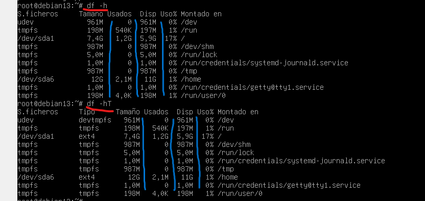

# Conociendo el servidor Linux

En este documento se muestran las capturas de los ejercicios realizados en el servidor Linux, acompañadas de explicaciones y con aspectos destacados en las imágenes.

---

## 1. Conociendo el sistema

### 1.1 Nombre del host
- `hostname`  
- `hostname -I`  
- `hostname -f`  
- `hostnamectl`  
- `cat /etc/hostname`  
Aquí podemos ver el nombre del host, la IP asociada y el FQDN.

### 1.2 Cambiar el hostname
- `hostnamectl set-hostname NuevoNombre`  
- `cat /etc/hostname`  
Cambiar el hostname con el ultimo comando arriba y tras exit y loggin

### 1.3 Versión del sistema
- `lsb_release -a`  
- `cat /etc/os-release`  
- `cat /etc/debian_version`  
Muestra la distribución y versión de Debian. 

 

### 1.4 Núcleo y arquitectura
- `uname -a`  
- `uname -r`  
Información del kernel y la arquitectura del sistema.

 

### 1.5 Memoria RAM
- `free`  
- `free -h`  
Se muestra la memoria total, usada y libre en MB/GB.

  

### 1.6 CPU
- `lscpu`  
- `nproc`  
Información sobre procesadores físicos, hilos y núcleos. 

 

### 1.7 Discos y particiones
- `lsblk`  
- `lsblk -f`  
- `fdisk -l`
Muestra los discos y particiones detectados en el sistema. 

 

### 1.8 Sistemas montados
- `df -h`  
- `df -hT`
Espacio en disco y tipo de sistema de archivos.  

  

### 1.9 Tamaño de carpetas
- `du -h /home/`  
- `du -hs /home`  
- `du -hs /home/*`
Uso de espacio en directorios y subdirectorios.

  

### 1.10 Usuarios y grupos

Archivos del sistema donde se almacenan usuarios, contraseñas y grupos.
- `cat /etc/passwd` / `getent passwd`  
- `cat /etc/shadow` / `getent shadow`  
- `cat /etc/group` / `getent group`  
- `cat /etc/gshadow` / `getent gshadow`
Salidas muy largas de comandos.
### 1.11 Información de la red
- `ip a`  
- `ip r`  
- `ping -c 1 <puerta_enlace>`  
- `ping -c 1 google.es`  
Se muestra la configuración de interfaces, gateway y latencia promedio.  

### 1.12 Configuración de la red
- `/etc/network/interfaces`  
- `/etc/resolv.conf` 
Configuración manual de interfaces y servidores DNS.
  
